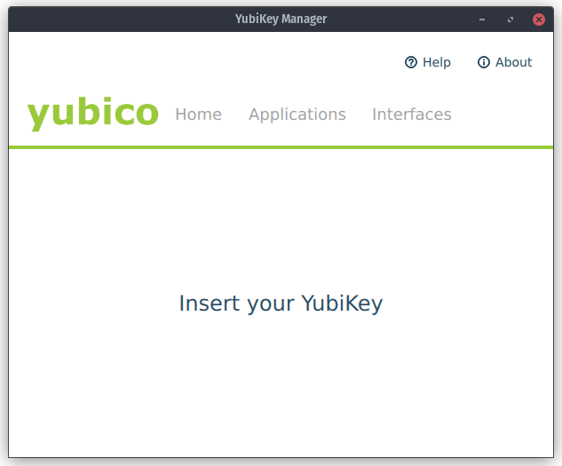

# Pop!\_OS 22.04 Setup for Software Engineers

This repository contains instructions to set up [Pop!\_OS](https://system76.com/pop) for developing software in Go, Rust, C# (.NET Core), Java, Python, and NodeJS, as well as web front-ends in React. The steps below should also work for Ubuntu and most Ubuntu-based Linux distributions.


## Update the OS and install common tools

The first thing you should do is get the latest security updates:

```bash
sudo apt update && sudo apt dist-upgrade -y
```

Next, install common development tools:

```bash
sudo apt install \
build-essential \
apt-transport-https \
ca-certificates \
curl \
software-properties-common \
apache2-utils \
make \
chromium-browser \
gnome-tweaks \
gnome-shell-extensions \
dconf-editor
```

Cleanup:

```bash
sudo apt autoremove -y
sudo apt autoclean -y
```

Check for firmware updates:

```bash
sudo fwupdmgr get-devices
sudo fwupdmgr get-updates
sudo fwupdmgr update
```

Reboot before proceeding any further:

```bash
sudo reboot now
```

## Improve Font Rendering

The default font rendering in Pop!\_OS may appear blurry on LCD monitors. Gnome's OS settings application lacks the ability to change font rendering. You must install the Gnome Tweak Tool to adjust these settings. Gnome Tweak Tool can be installed from the Pop!\_Shop or from a terminal as shown below:

1. Run `sudo apt install gnome-tweaks`
1. Run `gnome-tweaks`
1. **Fonts** > **Hinting** > Set to "Full"
1. **Fonts** > **Antialiasing** > Set to "Subpixel (for LCD screens)"

> The Pop!_OS defaults are: "Slight" for Hinting and "Standard" for Antialiasing, in case you want to switch back.

## Increase the inotify watch count

When working with Dropbox, React, and NodeJS, you may run into the following error: "User limit of inotify watches reached". The default limit for file watchers is 8,192. Increase this limit to something more reasonable:

1. Run `sudo gedit /etc/sysctl.conf`
1. Add `fs.inotify.max_user_watches=10000000` to the bottom of the file
1. Run `sudo sysctl -p` (or restart the OS)

## Tilix

Tilix may be preferable to the default Gnome terminal:

```bash
sudo apt install tilix
```

## Z Shell (ZSH)

**Instructions derived from https://github.com/ohmyzsh/ohmyzsh/wiki/Installing-ZSH on 2024-02-18**

[ZSH](https://en.wikipedia.org/wiki/Z_shell) can be installed by running:

```bash
sudo apt install zsh
```

Run `zsh --version` and look for `zsh 5.8.1 (x86_64-ubuntu-linux-gnu)` (or newer) to verify success

To set `zsh` as the default shell, run:

```bash
chsh -s $(which zsh)
```

Start a new session. ZSH is now your default shell.

### Optional: Install Oh-My-ZSH for ZSH configuration management
[Oh-My-ZSH](https://github.com/ohmyzsh/ohmyzsh) is an excellent tool for managing your ZSH configuration. Install it using the following command:

```bash
sh -c "$(wget -O- https://raw.githubusercontent.com/ohmyzsh/ohmyzsh/master/tools/install.sh)"
```

An "Oh My Zsh!... is now installed!" message should appear in the terminal output.

> You may be prompted to set ZSH as your default shell.

### Optional: Enable ZSH syntax highlighting
Install syntax highlighting for ZSH by running:

```bash
sudo apt install zsh-syntax-highlighting
```

Now run:

```bash
echo "source /usr/share/zsh-syntax-highlighting/zsh-syntax-highlighting.zsh" >> ~/.zshrc
```

The changes will be applied to new terminal windows.

### Optional: Change ZSH theme using Oh-My-ZSH

Oh-My-ZSH is installed with [several themes](https://github.com/ohmyzsh/ohmyzsh/wiki/Themes). Let's change the default theme to `blinks` by first opening the `.zshrc` file:

```bash
sudo gedit ~/.zshrc
```

Find the line `ZSH_THEME="robbyrussell"` and change it to `ZSH_THEME="blinks"` and save. The new theme will be applied to new terminal windows.

### Optional: Enable ZSH plugins

Plugins add functionality to ZSH. Let's enable some [pre-installed plugins](https://github.com/ohmyzsh/ohmyzsh/wiki/Plugins) for a few programming languages. First, open the `.zshrc` file:

```bash
sudo gedit ~/.zshrc
```

Find the line `plugins=(git)` and change it to include your preferred plugins. An example:

```
plugins=(git dotnet rust golang mvn npm terraform aws gradle)
```

Save the file. The plugins will be applied to new terminal windows.

## Install Eclipse for Java Developers

1. From the desktop, select **Activities** (top-left corner of your monitor) > **Pop!\_Shop**
1. Search for "Eclipse" and install "Eclipse for Java Developers"
1. Launch Eclipse

Alternatively, run the following command to install Eclipse from a terminal:

```bash
flatpak install flathub org.eclipse.Java
```

## Install JetBrains products (Rider, GoLand, IntelliJ IDEA Ultimate, etc)

**The instructions for installing JetBrains products are derived from https://www.jetbrains.com/help/idea/installation-guide.html#toolbox and are current as of 2024-03-09**

1. Visit https://www.jetbrains.com/toolbox/app/ and download the JetBrains Toolbox app.
1. Run the following commands, replacing the file name in the example with the file name you downloaded:

```bash
sudo tar -xzf jetbrains-toolbox-2.2.2.20062.tar.gz -C /opt
cd /opt/jetbrains-toolbox-2.2.2.20062
./jetbrains-toolbox
```

3. Select the product that you want to install.

## Install Postman

Postman is a complete toolchain for API developers. It can be installed in one of three ways. The easiest is to open the **Pop!_Shop** and install Postman using the GUI.

> Installing Postman from **Pop!_Shop** installs from Flathub.

You may alternatively install Postman from Flathub using a terminal session.

```bash
flatpak install flathub com.getpostman.Postman
```

## Install Zed

**The instructions for installing Zed are derived from https://zed.dev/docs/linux#zed-on-linux and are current as of 2024-07-13**

Zed is a highly-efficient, cross-platform code editor written in Rust.

Run the following command to install Zed:

```bash
curl https://zed.dev/install.sh | sh
```

To run Zed after installation:

```bash
~/.local/bin/zed
```

## Install Visual Studio Code

**The instructions for installing Visual Studio Code are derived from https://code.visualstudio.com/docs/setup/linux and are current as of 2024-02-19**

1. Run the following commands:

```bash
sudo apt-get install wget gpg
wget -qO- https://packages.microsoft.com/keys/microsoft.asc | gpg --dearmor > packages.microsoft.gpg
sudo install -D -o root -g root -m 644 packages.microsoft.gpg /etc/apt/keyrings/packages.microsoft.gpg
sudo sh -c 'echo "deb [arch=amd64,arm64,armhf signed-by=/etc/apt/keyrings/packages.microsoft.gpg] https://packages.microsoft.com/repos/code stable main" > /etc/apt/sources.list.d/vscode.list'
rm -f packages.microsoft.gpg
sudo apt install apt-transport-https
sudo apt update
sudo apt install code
```

2. Launch Visual Studio Code
1. Navigate **File** > **Preferences** > **Settings** and then type "telemetry"
1. Select "off" for the **Telemetry Level**
1. Disable the "Dotnet Acquisition Extension: Enable Telemetry" option
1. Optional: While still in **Settings**, change the following to "False":
   1. **Enable Natural Language Search**
   1. **Enable Experiments**
1. Optional: While still in **Settings**, enable **Editor: Format on Save**. Turning this setting on is the same as running the **Format Document** command each time you save a file.
1. Optional: While Visual Studio Code is open, select **Activities**, right-click the Visual Studio Code icon on the dock, and select **Add to favorites**.

> While you can install Visual Studio Code from flathub via the Pop!_Shop, doing so will result in problems finding development tools like the .NET SDK. The `.deb` package in Pop!_Shop is also many versions out-of-date. The process outlined above resolves both issues.


The following VS Code extensions are handy:

1. [HashiCorp Terraform](https://marketplace.visualstudio.com/items?itemName=HashiCorp.terraform)
1. [Go](https://marketplace.visualstudio.com/items?itemName=ms-vscode.Go)
1. [C# Dev Kit](https://marketplace.visualstudio.com/items?itemName=ms-dotnettools.csdevkit) - syntax highlighting, debugging, test runner support, and intellisense for C#
1. [Rust (rls)](https://marketplace.visualstudio.com/items?itemName=rust-lang.rust) - Rust language server
1. [CodeLLDB](https://marketplace.visualstudio.com/items?itemName=vadimcn.vscode-lldb) - for debugging Rust code on Ubuntu
1. [Extension Pack for Java](https://marketplace.visualstudio.com/items?itemName=vscjava.vscode-java-pack) - syntax highlighting, debugging, and intellisense for Java, plus unit testing support
1. [Spring Boot Extension Pack](https://marketplace.visualstudio.com/items?itemName=Pivotal.vscode-boot-dev-pack) - specific enhancements for working with Spring Boot
1. [VS Live Share](https://marketplace.visualstudio.com/items?itemName=MS-vsliveshare.vsliveshare) - allows simultaneous editing of code files by multiple authors, like Google Docs
1. [Docker](https://marketplace.visualstudio.com/items?itemName=PeterJausovec.vscode-docker)
1. [JavaScript Debugger for Chrome](https://marketplace.visualstudio.com/items?itemName=msjsdiag.debugger-for-chrome)
1. [Python](https://marketplace.visualstudio.com/items?itemName=ms-python.python)
1. [ESLint](https://marketplace.visualstudio.com/items?itemName=dbaeumer.vscode-eslint)
1. [TSLint](https://marketplace.visualstudio.com/items?itemName=ms-vscode.vscode-typescript-tslint-plugin)
1. [Prettier](https://marketplace.visualstudio.com/items?itemName=esbenp.prettier-vscode)

There are some excellent dark theme alternatives to the VS Code default theme:

1. [One Monokai Theme](https://marketplace.visualstudio.com/items?itemName=azemoh.one-monokai)
1. [Atom One Dark Theme](https://marketplace.visualstudio.com/items?itemName=akamud.vscode-theme-onedark)
1. [Material Theme](https://marketplace.visualstudio.com/items?itemName=Equinusocio.vsc-material-theme)
1. [Blueberry Dark Theme](https://marketplace.visualstudio.com/items?itemName=peymanslh.blueberry-dark-theme)
1. [Arc+ Theme](https://marketplace.visualstudio.com/items?itemName=ph-hawkins.arc-plus)
1. [Arc Darker Theme](https://marketplace.visualstudio.com/items?itemName=alvesvaren.arc-dark)
1. [Neon City](https://marketplace.visualstudio.com/items?itemName=lakshits11.neon-city)

## Terraform

**Instructions for installing Terraform taken from https://developer.hashicorp.com/terraform/install on 2024-06-29**

```bash
wget -O- https://apt.releases.hashicorp.com/gpg | sudo gpg --dearmor -o /usr/share/keyrings/hashicorp-archive-keyring.gpg
echo "deb [signed-by=/usr/share/keyrings/hashicorp-archive-keyring.gpg] https://apt.releases.hashicorp.com $(lsb_release -cs) main" | sudo tee /etc/apt/sources.list.d/hashicorp.list
sudo apt update && sudo apt install terraform
```

Run `terraform --version` to verify the installation was a success.

## Java and Maven

```bash
sudo apt install openjdk-17-jdk-headless maven
```

Run `javac -version` and look for the following output to verify success:

```
openjdk version "11.0.10" 2021-01-19
OpenJDK Runtime Environment (build 11.0.10+9-Ubuntu-0ubuntu1.20.04)
OpenJDK 64-Bit Server VM (build 11.0.10+9-Ubuntu-0ubuntu1.20.04, mixed mode, sharing)
```

## Go

**Instructions for installing Go taken from https://go.dev/doc/install on 2024-06-22**

While you _can_ install Go via `apt`, doing so installs an oudated version. Run the following commands instead, ensuring you replace the version number in the commands below with the version number you want to install. These are also the same commands you will use to update Go to a newer version.

```bash
curl -OL https://golang.org/dl/go1.22.4.linux-amd64.tar.gz
sha256sum go1.22.4.linux-amd64.tar.gz
sudo rm -rf /usr/local/go
sudo tar -C /usr/local -xzf go1.22.4.linux-amd64.tar.gz
```

Run the following command to verify success:

```bash
go version
```

Look for `go version go1.22.4 linux/amd64` (or newer) to verify success.

Set the following environment variables if this is the first time you're installing Go. _You do not need to repeat this step if you're upgrading Go._

```bash
echo "export PATH=$PATH:$(go env GOPATH)/bin:/usr/local/go/bin" >> ~/.profile
source ~/.profile
```

[Delve](https://github.com/go-delve/delve) is a debugger for Go. You can install it by running the following command:

```bash
go install github.com/go-delve/delve/cmd/dlv@v1.22.1
```

Run the following command to check that `dlv` is installed and you're on an up-to-date version:

```bash
dlv version
```

You should see the following after running `dlv version`:

```
Delve Debugger
Version: 1.22.1
Build: $Id: 0c3470054da6feac5f6dcf3e3e5144a64f7a9a48
```


## Rust

**Instructions for installing Rust taken from https://www.rust-lang.org/tools/install on 2024-02-18**

```bash
curl --proto '=https' --tlsv1.3 -sSf https://sh.rustup.rs | sh
```

Restart your terminal session, or run `source "$HOME/.cargo/env"`, and then run `rustc --version`. Look for `rustc 1.76.0 (07dca489a 2024-02-04)` (or newer) to verify success.

To update Rust:

```bash
rustup update
```

## Python

```bash
sudo apt install python3-minimal
```

Run `python3 --version` and look for `Python 3.8.5` (or newer) to verify success

To install Anaconda Python instead, see https://linuxhint.com/install_anaconda_python_ubuntu_1804/.

## NodeJS

The quick way to install NodeJS 20 (LTS):

```bash
curl -fsSL https://deb.nodesource.com/setup_20.x | sudo -E bash - &&\
sudo apt-get install -y nodejs
```

Run `node --version`  to verify success.

## .NET Core

```bash
sudo apt install dotnet-sdk-8.0
```

Run `dotnet --list-sdks` and look for the following output to verify success:

```
8.0.107 [/usr/lib/dotnet/sdk]
```

### Optional: Disable .NET Core telemetry

1. Run `gedit ~/.profile`
1. Type `export DOTNET_CLI_TELEMETRY_OPTOUT=true` at the bottom of the file
1. Save and exit
1. Log out and log in again

## Wireshark

There are several ways to install Wireshark from `apt`.

### Option #1: Install from ppa

The latest, or at least close to latest, version of Wireshark can be installed via:

```bash
sudo add-apt-repository ppa:wireshark-dev/stable
sudo apt update
sudo apt install wireshark
```

### Option #2: Install from `apt`:

An older version of Wireshark can be installed by running:

```bash
sudo apt install wireshark
```

This will likely install an older version versus using installtion option #1 above.

> At the time of writing this section, option #1 installs version 4.2.5 while option #2 installs Wireshark 3.6.


### Configure Wireshark

1. It is recommended to choose **Yes** when the installer asks: "Should non-superusers be able to capture packets?" If you fail to select **Yes** then you will need root privileges to run Wireshark.

> Requiring root privileges means running `wireshark` with `sudo`.

> If you want to change your answer from **No** to **Yes** in the future, run `sudo dpkg-reconfigure wireshark-common`.

2. Next, add your user to the `wireshark` group. Run this command exactly as-is:

```bash
sudo usermod -a -G wireshark "$USER"
```

3. Ensure your username is part of the `wireshark` group. You should see your username when you run the below command:

```bash
groups "$USER"
```

4. Log out and log in to Pop!_OS.
5. Run Wireshark and capture some packets.

## Set Wireshark to Dark Mode

**The following instructions are derived from a [response to a GitHub issue](https://github.com/pop-os/shell/issues/1642#issuecomment-2136726171).**

By default, Wireshark `4.2.5` does not respect the Dark mode selector in Pop!_OS `22.04` or Dark mode themes like Nordic-darker-v40 or Arc Dark. We can fix this, albeit partially:

1. Install the Adwaita-qt theme:

```bash
sudo apt install adwaita-qt
```

2. Run Wireshark using the following terminal command:

```bash
QT_STYLE_OVERRIDE=Adwaita-Dark wireshark
```


## Podman

**The instructions for installing Podman are derived from https://podman-desktop.io/downloads and are current as of 2024-06-22**

Podman is an open source alternative to Docker Desktop. To install Podman Desktop client:

```
flatpak install flathub io.podman_desktop.PodmanDesktop
```

To install Podman itself:

```
sudo apt-get update
sudo apt-get -y install podman
```

Podman commands are similar to Docker commands. Example: `podman compose up` instead of `docker-compose up` and `podman ps` instead of `docker ps`. Podman also installs `kubectl` if you select the Kubernetes extension on initial setup.

Run `podman version` and look for the following:

```
Version:      3.4.4
API Version:  3.4.4
Go Version:   go1.18.1
Built:        Wed Dec 31 19:00:00 1969
OS/Arch:      linux/amd64
```

A Podman tutorial is available at https://github.com/containers/podman/blob/main/docs/tutorials/podman_tutorial.md.

### Podman alternative: Docker Desktop

**The instructions for installing Docker Desktop are derived from https://docs.docker.com/desktop/install/linux-install/ and are current as of 2024-02-18**

As an alternative to Podman Desktop, Docker Desktop can now be installed on Linux. It provides the same functionality as Docker Desktop on macOS and Windows and includes a single-node Kubernetes cluster. It is recommended to either install Docker Desktop _or_ install Docker on Linux, but not both (though both can be present simultaneously).

This guide has been updated to focus on installing Docker Desktop.

> You may **not** want to install Docker Desktop if you are running Pop!_OS in a virtual machine, as Docker Desktop installs its own virtual machine; this would be virtualization-within-virtualization and may cause problems. You'd alternatively want to consider installing Docker on Linux directly without "Docker Desktop". This is the traditional way Docker has been installed on Linux. Older versions of this guide describe how this can be done. See [/older-versions](/older-versions).

There is no repository for installing Docker Desktop.

1. Download the `.deb` package from https://docs.docker.com/desktop/install/ubuntu/.
1. Run `sudo apt-get install ./docker-desktop-<version>-<arch>.deb`
1. Either open the **Docker Desktop** app that was installed, or run `systemctl --user start docker-desktop`

Verify success by running `docker --version`. You should see something like the following:

```
Docker version 25.0.3, build 4debf41
```

## Helm

**The instructions for installing Helm are derived from https://helm.sh/docs/intro/install/ and are current as of 2024-06-24**

Install Helm by issuing the following commands:

```bash
curl -fsSL -o get_helm.sh https://raw.githubusercontent.com/helm/helm/main/scripts/get-helm-3
chmod 700 get_helm.sh
./get_helm.sh
```

Run `helm version` to verify success.

## Azure CLI tools

**The instructions for installing Azure CLI tools are derived from https://learn.microsoft.com/en-us/cli/azure/install-azure-cli-linux?pivots=apt&view=azure-cli-latest and are current as of 2024-06-24**

The simplest way to install the Azure CLI tools:

```bash
curl -sL https://aka.ms/InstallAzureCLIDeb | sudo bash
```

Verify success by running `az --version` and checking that `azure-cli 2.61.0` (or newer) appears somewhere in the output. Additionally, the output should indicate that `Your CLI is up-to-date`.

You can periodically run `az upgrade` to upgrade the Azure CLI tools.

> See [Install Azure CLI with apt](https://docs.microsoft.com/en-us/cli/azure/install-azure-cli-apt?view=azure-cli-latest) for further information and alternative installation methods.

## Azure Storage Explorer

Azure's desktop app for interacting with Azure Storage is cross-platform. It is available in the **Pop!\_Shop** via FlatHub. Installing it on an Ubuntu-based distribution can also be done in the terminal as follows:

```bash
flatpak install flathub com.microsoft.AzureStorageExplorer
```

## AWS CLI tools

**The instructions for installing AWS CLI tools are derived from https://docs.aws.amazon.com/cli/latest/userguide/getting-started-install.html and are current as of 2024-06-29**

The following script installs v2 of the AWS CLI tools:

```bash
sudo apt install -y unzip
curl "https://awscli.amazonaws.com/awscli-exe-linux-x86_64.zip" -o "awscliv2.zip"
unzip awscliv2.zip
sudo ./aws/install
```

Run `aws --version` and check for `aws-cli/2.17.5 Python/3.11.8 Linux/6.9.3-76060903-generic exe/x86_64.pop.22` to verify success.

To update AWS CLI, add your existing symlink and installer information to construct the install command. This is done using the `--bin-dir`, `--install-dir`, and `--update` parameters. The following command block uses an example symlink of `/usr/local/bin` and example installer location of `/usr/local/aws-cli`. These locations are the defaults that would have been used during installation unless you specified otherwise.

```bash
curl "https://awscli.amazonaws.com/awscli-exe-linux-x86_64.zip" -o "awscliv2.zip"
unzip awscliv2.zip
sudo ./aws/install --bin-dir /usr/local/bin --install-dir /usr/local/aws-cli --update
```

See https://docs.aws.amazon.com/cli/latest/userguide/getting-started-install.html for additional information.

## Kubernetes CLI tools (`kubectl`)

**Instructions derived from https://kubernetes.io/docs/tasks/tools/install-kubectl-linux/ on 2024-02-18**

You may not need to follow these commands to install `kubectl` if you installed Docker Desktop. Run `kubectl version` to see if it's already installed. If not, follow the commands below:

```bash
sudo apt update
sudo apt install -y apt-transport-https ca-certificates curl
# If the folder `/etc/apt/keyrings` does not exist, it should be created before the curl command, read the note below.
# sudo mkdir -p -m 755 /etc/apt/keyrings
curl -fsSL https://pkgs.k8s.io/core:/stable:/v1.29/deb/Release.key | sudo gpg --dearmor -o /etc/apt/keyrings/kubernetes-apt-keyring.gpg
echo 'deb [signed-by=/etc/apt/keyrings/kubernetes-apt-keyring.gpg] https://pkgs.k8s.io/core:/stable:/v1.29/deb/ /' | sudo tee /etc/apt/sources.list.d/kubernetes.list
sudo apt update
sudo apt install -y kubectl
```

Run `kubectl version` to verify success.


## GitHub CLI tools

**The instructions for installing GitHub CLI tools are derived from https://github.com/cli/cli/blob/trunk/docs/install_linux.md and are current as of 2024-02-18**

```bash
type -p curl >/dev/null || (sudo apt update && sudo apt install curl -y)
curl -fsSL https://cli.github.com/packages/githubcli-archive-keyring.gpg | sudo dd of=/usr/share/keyrings/githubcli-archive-keyring.gpg \
&& sudo chmod go+r /usr/share/keyrings/githubcli-archive-keyring.gpg \
&& echo "deb [arch=$(dpkg --print-architecture) signed-by=/usr/share/keyrings/githubcli-archive-keyring.gpg] https://cli.github.com/packages stable main" | sudo tee /etc/apt/sources.list.d/github-cli.list > /dev/null \
&& sudo apt update \
&& sudo apt install gh -y
```

## Git configuration

```bash
git config --global user.name "Your Name"
git config --global user.email yourname@yourdomain.com
git config --global init.defaultBranch main
```

See [Customizing Git Configuration](https://www.git-scm.com/book/en/v2/Customizing-Git-Git-Configuration) for more details. You can edit the global Git config file by running `gedit ~/.gitconfig` in a terminal window.

> Tip: Remember that you can include a longer commit message by using a second `-m` in your command. Example: `git commit -m "The short message, best ~50 characters" -m "The extended description that can go on however long you want."`

## SSH Keys for GitHub/GitLab

**The instructions for generating SSH keys is derived from https://docs.github.com/en/authentication/connecting-to-github-with-ssh/generating-a-new-ssh-key-and-adding-it-to-the-ssh-agent. Instructions for adding an SSH key to GitHub is derived from https://docs.github.com/en/authentication/connecting-to-github-with-ssh/adding-a-new-ssh-key-to-your-github-account. Both are current as of 2024-02-18**

1. Run `ssh-keygen -t ed25519 -C "your_email@example.com"`
1. Enter a passphrase
1. Run `ssh-add ~/.ssh/id_ed25519`
1. Run `cat ~/.ssh/id_ed25519.pub`
1. Copy the output from `cat` and paste it into GitLab and GitHub's SSH key sections for your profile
1. Run `ssh -T git@github.com` to [verify the key is recognized and working with GitHub.com](https://help.github.com/en/github/authenticating-to-github/githubs-ssh-key-fingerprints)
1. Run `ssh -T git@gitlab.com` to verify the key is recognized and working with GitLab

## GPG Keys for signing commits

Taken from https://docs.gitlab.com/ee/user/project/repository/gpg_signed_commits/index.html.

1. Run `gpg --full-gen-key`
1. Choose "RSA and RSA (default)"
1. Choose 4096 bits
1. Choose 2y (or a timeframe of your choosing)
1. Provide the other required inputs
1. Run `gpg --list-secret-keys --keyid-format LONG mr@robot.sh` (replace `mr@robot.sh` with the email you used previously)
1. Copy the GPG key ID that starts with `sec`. E.g. in `sec rsa4096/30F2B65B9246B6CA 2017-08-18 [SC]`, the key ID is `30F2B65B9246B6CA`
1. Run `gpg --armor --export 30F2B65B9246B6CA`
1. Run `git config --global user.signingkey 30F2B65B9246B6CA`
1. [Add the key to your GitHub account](https://help.github.com/articles/adding-a-new-gpg-key-to-your-github-account/)

To sign commits, the only difference is the addition of the `-S` flag:

```bash
git commit -S -m "My commit msg"
```

## VLC for media playback

```bash
sudo apt install -y vlc
sudo apt install -y libavcodec-extra libdvd-pkg
sudo dpkg-reconfigure libdvd-pkg
```

## Other Items in Pop!\_Shop to consider installing:

1. Dropbox
1. Slack
1. Spotify
1. VirtualBox
1. Zoom
1. Microsoft Teams
1. VLC - for playing media files
1. Peek - for recording your screen and producing animated GIFs
1. GNU Image Manipulation Program
1. Htop
1. Bleachbit - for secure file erasure and general disk cleanup

## Firefox

1. Install the [React Developer Tools](https://addons.mozilla.org/en-US/firefox/addon/react-devtools/) addon
1. **Preferences** > **Search** > Change the search engine to "[DuckDuckGo](https://duckduckgo.com/)" (or your preferred engine)
1. **Preferences** > **Privacy** > Change tracking and protection settings as-needed

### Optional: Enable DNS over HTTPS

1. Navigate to **Edit** > **Settings**
1. In the **Privacy & Security** tab, scroll down to **Enable DNS over HTTPS** and select **Max Protection**
1. Select "Cloudflare" as the provider

### Optional: Force GPU rendering to smooth out page scrolling

Firefox in Gnome can experience screen tearing and other performance-inhibiting behavior. This may be adjustable by forcing GPU rendering, though it may impact power usage and stability. This has only been tested using NVIDIA GPUs.

1. Navigate to `about:config` in the Firefox URL bar
1. Select **Accept the Risk and Continue**
1. Copy and paste `layers.acceleration.force-enabled` into the search box and **Enable** it
1. Copy and paste `layers.force-active` into the search box and **Enable** it
1. Restart Firefox and observe smoother scrolling behavior

### Optional: Enable enhanced privacy protections

See https://wiki.mozilla.org/Privacy/Privacy_Task_Force/firefox_about_config_privacy_tweeks for advanced privacy-related Firefox configuration options.

## Chromium

1. From the desktop, select **Activities** (top-left corner of your monitor) > **Pop!\_Shop**
1. Search for "Chromium Browser" and install it
1. Navigate to https://chrome.google.com/webstore/category/extensions and search for "React Developer Tools"
1. Add the [React Developer Tools](https://chrome.google.com/webstore/detail/react-developer-tools/fmkadmapgofadopljbjfkapdkoienihi) to Chromium

### Optional: Change Chromium's privacy settings

1. In Chromium, press the "..." button at the top-right corner of the Chromium window to bring up the options menu
1. **Settings** > **Search Engine** > Set to "Duck Duck Go" (or your preferred engine)
1. **Settings** > **Advanced** > **Privacy & Security** >
   1. **Allow Chromium sign-in** > Disable
   1. **Use a prediction service to help complete searches and URLs typed in the address bar** > Disable
   1. **Use a web service to help resolve navigation errors** > Disable
   1. **Send a "Do Not Track" request with your browsing traffic** > Enable
   1. **Allow sites to check if you have payment methods saved** > Disable
   1. **Content Settings** >
      1. **Cookies** > **Block third-party cookies** > Enable
      1. **Location** > Block
      1. **Microphone** > Block
      1. **Camera** > Block
      1. **Flash** > Set to "Block sites from running Flash"
      1. **Clipboard** > Set to "Do not allow sites to see text and images copied to the clipboard"
      1. **Payment Handlers** > Set to "Do not allow any site to install payment handlers"

### FYI: How to configure VS Code for **Chromium** JavaScript debugging

Visual Studio Code can [launch Google Chrome in JavaScript debug mode](https://code.visualstudio.com/docs/nodejs/reactjs-tutorial#_configure-the-chrome-debugger) so developers can do useful things like set breakpoints and inspect JavaScript variables at runtime. However, [Microsoft's official guidance on how to configure the Chrome Debugger](https://code.visualstudio.com/docs/nodejs/reactjs-tutorial#_configure-the-chrome-debugger) only works with _Chrome_ and not _Chromium_.

Google Chrome is a commercial, closed-source product. It's based on the open source Chromium project. If you'd like to use Chromium for JavaScript debugging instead of Chrome, you can still follow Microsoft's guide. You'll just need to add a `runtimeExecutable` property to the `launch.json` file in your web app's `.vscode` directory. Just make sure it points to where `chromium-browser` is installed. If you installed Chromium from the Pop!\_Store then it should be located at `/usr/bin/chromium-browser`.

The `launch.json` file will automatically be created if you follow along with [Microsoft's how-to guide](https://code.visualstudio.com/docs/nodejs/reactjs-tutorial#_configure-the-chrome-debugger).

The `launch.json` file needed to debug using Chromium is shown below:

```json
{
  "version": "0.2.0",
  "configurations": [
    {
      "type": "chrome",
      "request": "launch",
      "name": "Launch Chrome against localhost",
      "url": "http://localhost:3000",
      "webRoot": "${workspaceFolder}",
      "runtimeExecutable": "/usr/bin/chromium-browser"
    }
  ]
}
```

## Installing and Enabling Themes

**The instructions for enabling and installing themes are derived from https://ubuntuhandbook.org/index.php/2022/05/install-themes-ubuntu-22-04/ and are current as of 2024-06-22**

We need to first install shell extensions and an extension manager:

```bash
 sudo apt install gnome-shell-extensions
 sudo apt install gnome-shell-extension-manager
 ```

Next, open the **Extension Manager** app and navigate to **Browse**. Select **Install** next to the "User Themes" list item. Wait for this to finish and then close the Extension Manager app.

Some themes are available in the central repos. For instance, to install the excellent Arc theme, simply run `sudo apt install arc-theme`. "Arc-Dark" is then available as a theme in **Gnome Tweak Tool**.

More themes are available for download on pling.com. For these, extra steps are required to install:

1. Create folders for the themes and icons:

```bash
mkdir ~/.themes
mkdir ~/.icons
```

2. Download a Gnome theme from Pling to your `Downloads` folder. (We'll use the [WhiteSur GTK theme](https://www.pling.com/p/1403328/))
1. Extract the contents of the `.tar.xz` to the `.themes` folder
1. Download a Gnome icon theme from Pling to your `Downloads` folder. (We'll use the [Tela Icon Theme](https://www.pling.com/p/1279924))
1. Extract the contents of the `.tar.xz` to the `.icons` folder
1. Open the **Tweaks Tool**
1. Navigate to the **Apperance** tab
1. Select "White Sur-Dark" under **Themes** > **Applications**
1. Select "White Sur-Dark" under **Themes** > **Shell**
1. Select "Tela-dark" under **Themes** > **Icons**
1. Close **Tweak Tool**


## Installing Fonts

Install the **Font Manager** application:

```bash
sudo apt install font-manager
```

Let's install Red Hat's free Overpass font. It can be downloaded or cloned: https://github.com/RedHatOfficial/Overpass.

Other good font replacements are:
- [Source Sans Pro](https://github.com/adobe-fonts/source-sans)
- [Source Code Pro](https://github.com/adobe-fonts/source-code-pro)
- [Inconsolata](https://github.com/googlefonts/Inconsolata)
- [Inter](https://fonts.google.com/specimen/Inter)

Open **Font Manager** and press the **+** button to add a new font. Navigate to the extracted ZIP file (or cloned git repo) and import either the OTF or TTF files, whichever you prefer.

Open **Tweak Tool** and open the **Fonts** tab. Select "Overpass" from the **Interface Text** drop-down list. The changes should be visible immediately.

> If you ever want to go back to the default interface font, it's "Fira Sans Book" at size 10.

> Some custom fonts, including "Overpass", may look better with **Hinting** set to "None".

## VirtualBox

1. From the desktop, select **Activities** (top-left corner of your monitor) > **Pop!\_Shop**
1. Search for "VirtualBox" and install it

To allow USB pass-through to a guest OS in VirtualBox:

1. Run `sudo adduser $USER vboxusers`
1. Log out and in again


## KVM + QEMU + VirtManager

**Instructions derived from https://ubuntu.com/blog/kvm-hyphervisor?ref=itsfoss.com and https://www.youtube.com/watch?v=BgZHbCDFODk**

An alternative to VirtualBox is to use Linux's built-in Kernel Virtual Machine (KVM) plus QEMU and VirtManager for a GUI front-end.

```bash
sudo apt -y install bridge-utils cpu-checker libvirt-clients libvirt-daemon qemu qemu-kvm virt-manager
```

Check that your processor supports virtualization:

```bash
kvm-ok
```

Look for:

```
INFO: /dev/kvm exists
KVM acceleration can be used
```

Add the current user to the kvm group, being sure to replace `yourusername` with your actual user name:

```bash
sudo usermod -aG libvirt yourusername
sudo usermod -aG kvm yourusername
```

Restart your system and then run these commands:

```bash
sudo systemctl start libvirtd
sudo systemctl enable libvirtd
```

### Create a new VM using `virt-manager`
1. Download a [Pop!_OS ISO](https://pop.system76.com/) or the ISO of your choice
1. Place the `.iso` file into the `/var/lib/libvirt/images` folder
1. Open the **Virtual Machine Manager** (aka `virt-manager`)
1. Add a new virtual machine. Note that if you get a connection error, you should reboot your machine.
1. Select **Local install media** and then **Forward**. Step 2 of 5 appears.
1. Select **Browse**. The ISO you copied into the `/var/lib/libvirt/images` folder should appear.
1. Select the ISO and choose **Choose Volume**
1. You  may need to select an operating system. if Virtual Machine Manager couldn't auto-detect one based on the ISO. In our case, if using Pop!_OS 22.04, select "Ubuntu 22.04 LTS"
1. Select **Forward**
1. Choose at least "8192" for memory and 2 CPUs and then select **Forward**
1. Choose at least 25 GB of disk storage and select **Forward**
1. Use a distinctive name for the VM, such as "K3s-pop-os" and select **Finish**
1. The VM should start automatically. Go through the VM setup process.

Run `sudo apt update && sudo apt upgrade -y` after OS configuration.

### Taking VM snapshots in `virt-manager`

Snapshots can be taken in `virt-manager` just like in Virtual Box. You must navigate into the VM window (not the Virtual Machine Manager window) and select the **Manage VM Snapshots** icon at the far right of the toolbar.

## Set up and connect to MySQL Server running in Docker

**Instructions derived from https://hub.docker.com/_/mysql using MySQL 8.3.0 and are current as of 2024-03-11**

One can run MySQL Server in a Docker container rather than installing MySQL locally. Start a MySQL Docker container by running the following two commands:

```bash
docker network create -d bridge my-bridge-network
docker run --network my-bridge-network -p 3306:3306 --name go-test-mysql -e MYSQL_ROOT_PASSWORD=my-secret-pw -d mysql:latest
```

> The `-p 3306:3306` is what allows you to connect to this MySQL container from the host system, such as what you might do when developing an app.

Next, start a _second_ MySQL container that connects to the first:

```bash
docker run -it --network my-bridge-network --rm mysql mysql -hgo-test-mysql -uroot -pmy-secret-pw
```

You should now see a `mysql>` prompt. Type `exit` to return to the terminal. Exiting destroys this second container, so to get another MySQL prompt you will need to re-run the above command. This is a nice way to query the MySQL database without needing to install MySQL command line tools.

An empty database server is probably not that handy. To load a `.sql` database into the first MySQL container, named `go-test-mysql` in the commands above, you can issue the command below. Replace the `/home/your-username/databases/data.sql` path with an actual path to a `.sql` file on your file system.

```bash
docker exec -i go-test-mysql sh -c 'exec mysql -uroot -p"my-secret-pw"' < /home/your-username/databases/data.sql
```

Now run the second Docker container again using the same command as before:

```bash
docker run -it --network my-bridge-network --rm mysql mysql -hgo-test-mysql -uroot -pmy-secret-pw
```

You should once again see a `mysql>` prompt.

1. Enter `SELECT DATABASE();` to see what database(s) are in your server.
1. Enter `use yourdatabasename` to open a database from the list, replacing `yourdatabasename` with the name of one of the databases listed in the output of the previous step.
1. Enter `SHOW TABLES();` to see what tables exist in this database.

You can now run `SELECT` and other queries against the database. Be sure to end all of your commands with a `;`.

Here's an example of how you can connect to this database and test the connection in a simple GoLang app:

```golang
package main

import (
	"database/sql"
	"fmt"
	"log"

	"github.com/go-sql-driver/mysql"
)

var db *sql.DB

func main() {
	dsn := mysql.Config{
		User:   "root",
		Passwd: "my-secret-pw",
		Net:    "tcp",
		Addr:   "127.0.0.1:3306",
		DBName: "yourdatabasename",
	}

	var err error
	db, err = sql.Open("mysql", dsn.FormatDSN())
	if err != nil {
		log.Fatal(err)
	}

	defer db.Close()

	pingErr := db.Ping()
	if pingErr != nil {
		log.Fatal(pingErr)
	} else {
		fmt.Println("Connected!")
	}
}
```

## Set up and connect to MariaDB Server running in Docker

**Instructions derived from https://hub.docker.com/_/mariadb using MariaDB 11.4.1 and are current as of 2024-03-11**

One can run MariaDB in a Docker container rather than installing MariaDB locally. Start a Maria Docker container by running the following two commands:

```bash
docker network inspect my-bridge-network >/dev/null 2>&1 || docker network create --driver bridge my-bridge-network
docker run --detach --name some-mariadb --network my-bridge-network -p 3306:3306 --env MARIADB_ROOT_PASSWORD=my-secret-pw  mariadb:latest
```

> The `-p 3306:3306` is what allows you to connect to this MariaDB container from the host system, such as what you might do when developing an app.

Next, start a _second_ MariaDB container that connects to the first:

```bash
docker run -it --network my-bridge-network --rm mariadb mariadb -hsome-mariadb -uroot -pmy-secret-pw
```

You should now see a `MariaDB [(none)]>` prompt. Type `\s` and press **Enter** to verify success. Type `exit` to return to the terminal.

## Set up and connect to PostgreSQL Server running in Docker

One can run PostgreSQL in a Docker container rather than installing locally. Start a PostgreSQL Docker container by running the following two commands:

```bash
docker network inspect my-bridge-network >/dev/null 2>&1 || docker network create --driver bridge my-bridge-network
docker run --detach --name postgres --network my-bridge-network -p 5432:5432 --env POSTGRES_PASSWORD=my-secret-pw postgres:latest
```

> The `-p 5432:5432` is what allows you to connect to this PostgreSQL container from the host system, such as what you might do when developing an app.

Next, start a _second_ PostgreSQL container that connects to the first:

```bash
docker run -it --network my-bridge-network --rm --name second-postgres postgres psql -U postgres
```

You should now see a `postgres=#` prompt. Type `SELECT table_name FROM information_schema.tables;` and press **Enter** to verify success. Type `q` to exit the table list view. 


## Resolve Bluetooth issues

This section is if you're having trouble pairing Bluetooth devices. Edit this file first:

```sh
sudo nano /etc/bluetooth/main.conf
```

Find the line `#ControllerMode = dual`. Uncomment and replace `dual` with `bredr`. This is a mode that has higher compatibility with more devices.

Save the file and exit.

Apply the changes:

```sh
sudo service bluetooth restart
```

You can scan for Bluetooth devices by running this command:

```sh
bluetoothctl scan on
```

And you can pair with a device by its address:

```sh
bluetoothctl pair [device address]
```

## Configure a hardware security key

**Instructions derived from https://support.yubico.com/hc/en-us/articles/360016649099-Ubuntu-Linux-Login-Guide-U2F on 2024-06-24**

Let's install some needed packages:

```bash
sudo apt install libpam-u2f libu2f-udev libpam-yubico yubikey-manager
```

Plug in your USB key and run this command:

```bash
ykman list --serials
```

If a serial number was displayed then the key software is working correctly and has detected and identified your key.

Now run the following command, replacing `12345` with the serial number from the last command's output.

```bash
ykman --device 12345
```

You should see output similar to the following:

```
Device type: [Type of key you have]
Serial number: 12345
Firmware version: x.x.x
Form factor: Keychain (USB-x)
Enabled USB interfaces: ...
...
```

We can now proceed that we know everything is working.

It's a good idea to set a FIDO PIN for your hardware security keys. PINs are optional but recommended in the event the keys are stolen. Some websites will require the use of the PIN to use the key but others may not. Unlike a password, however, the PIN stays on your key and is not transmitted to the website or web service.

> Warning: With YubiKeys, 8 failed PIN attempts will erase the key, so be warned if you set a PIN. Have backups and memorize your PIN code.

> PINs can include letters and other characters, not just numbers. The max length of a PIN for YubiKeys is quite large, around 256 characters total.

> Warning: If you already have a PIN and you change it, it will erase all access credentials previously stored on the key. Do not change the PIN without considering this first!

Issue this command to set a PIN for the first time:

```bash
ykman fido access change-pin
```

Or this command to change a PIN:

```bash
$ ykman fido access change-pin --pin 123456 --new-pin 456789
```

Now let's move on to registering the key with the OS. First execute another command to create a special folder:

```bash
mkdir -p ~/.config/Yubico
```

> The -p flag in `mkdir` signals to create the parent folder if it doesn't already exist.

Now insert your hardware security key and run the following command:

```bash
pamu2fcfg > ~/.config/Yubico/u2f_keys
```

Touch the key (e.g. if you have a YubiKey with this feature) and the command should finish.

For your second, backup key, you will remove the first key and insert the backup. Now run this __different__ command (not the previous command).

```bash
pamu2fcfg -n >> ~/.config/Yubico/u2f_keys
```

Again, touch the key (e.g. if you have a YubiKey with this feature) and the command should finish. Both primary and secondary keys are now configured in Linux.

We can optionally move the file to a safer location, one that requires `sudo` to modify. This is more secuire than the home directory.

```bash
sudo mkdir /etc/Yubico
sudo mv  ~/.config/Yubico/u2f_keys /etc/Yubico/u2f_keys
```

Your key is now setup such that you can require it's use for `sudo` access, LUKS, GDM, TTY, SSH access, and more.

### Install YubiKey Manager (GUI)

**Instructions derived from https://support.yubico.com/hc/en-us/articles/360016649039-Installing-Yubico-Software-on-Linux on 2024-06-26**

If using YubiKeys, you can install a GUI app to manage your keys.



Make sure `pcscd` is installed and running before starting the GUI app. To install `pcscd`:

```bash
sudo apt install pcscd
```

To check if `pcscd` is already running:

```bash
sudo systemctl status pcscd
```

To start `pcscd` if it's not already running, run this command:

```bash
sudo systemctl enable --now pcscd
```

With `pcscd` installed and running we can now install the YubiKey Manager (GUI) app:

1. Download the [YubiKey Manager (GUI) AppImage](https://developers.yubico.com/yubikey-manager-qt/Releases/yubikey-manager-qt-latest-linux.AppImage).
1. Run `chmod a+x yubikey-manager-qt-1.2.5-linux.AppImage` in a terminal.
1. Run `./yubikey-manager-qt-1.2.5-linux.AppImage` in a terminal to start the app.

> Warning: If you already have a FIDO PIN and you change it, it will erase all access credentials previously stored on the key. Do not change the FIDO PIN without considering this first!

## Install and Configure USBGuard

USBGuard enables you to block USB device access. This is useful for protecting against rogue USB devices (think "BadUSB") by implementing a USB blocklist and USB device policy.

> Warning: Installing USBGuard using the steps below will create a policy that allows only currently-connected USB devices to be usable on the next boot. You can and should review this policy right after installation to ensure you can continue to use your PC. For instance, if you use hardware security keys to login, and they were not inserted at the time of USBGuard's installation, you could be locked out of your system permanently. Be cautious.

Let's install some packages:

```bash
sudo apt install usbguard usbutils udisks2 usbview
```

You can graphically view USB devices by running one of the packages we just installed:

```bash
sudo usbview
```

Or through either of these terminal commands:

```bash
lsusb
usb-devices | less
```

Let's next start and stop the service to generate the necessary configuration files:

```bash
sudo systemctl enable usbguard.service --now
sudo systemctl start usbguard.service
sudo systemctl stop usbguard.service
```

Now let's modify these configuration files. Open a root terminal and navigate to the `usbguard` directory:

```bash
sudo -i
cd /etc/usbguard
ls -laF
```

```
total 36
drwxr-xr-x   3 root root  4096 Jun 27 08:36 ./
drwxr-xr-x 149 root root 12288 Jun 27 08:36 ../
drwxr-xr-x   2 root root  4096 Jun 25 19:09 IPCAccessControl.d/
-rw-------   1 root root  4535 Jun 27 08:36 rules.conf
-rw-------   1 root root  6653 Apr 13  2022 usbguard-daemon.conf
```

Let's look at the policy:

```bash
sudo grep -vE '^#|^$' /etc/usbguard/usbguard-daemon.conf
```

```ini
RuleFile=/etc/usbguard/rules.conf
ImplicitPolicyTarget=block
PresentDevicePolicy=apply-policy
PresentControllerPolicy=keep
InsertedDevicePolicy=apply-policy
AuthorizedDefault=none
RestoreControllerDeviceState=false
DeviceManagerBackend=uevent
IPCAllowedUsers=root
IPCAllowedGroups=root plugdev
IPCAccessControlFiles=/etc/usbguard/IPCAccessControl.d/
DeviceRulesWithPort=false
AuditBackend=FileAudit
AuditFilePath=/var/log/usbguard/usbguard-audit.log
HidePII=false
```

See `ImplicitPolicyTarget=block` on line 2. This line tells the daemon how to treat USB devices that fail to match a rule in the policy. Allowed values are `allow`, `block` or `reject`. A policy of `reject` logically removes the device node from the system.

See `PresentDevicePolicy` on line 3. This line tells the daemon how to treat USB devices that are already connected when the daemon starts. Allowed values are `allow`, `block`, `reject`, `keep` (this maintains the state the device is in) or `apply-policy`. The `apply-policy` default simply means to apply the rules to each USB device.

Let's look at the default policy that was created when we started and then stopped the daemon:

```bash
sudo nano /etc/usbguard/rules.conf
```

You should see that all currently connected devices are listed with `allow` as the permission.

Now let's start the daemon and check to see if it's working:


```bash
sudo systemctl restart usbguard.service
sudo systemctl status usbguard.service
sudo usbguard list-rules
```

You can list all USB devices recognized by the daemon:

```bash
sudo usbguard list-devices
```

You can verify it's working by plugging in a USB device and running:

```bash
lsusb
```

Look for the USB device in the list. It should appear, but it shouldn't work - that is, if you plugged in a USB thumb drive, it shouldn't appear as new storage. Let's confirm by running this command:

```bash
sudo dmesg | grep -i 'authorized'
```

If you see the following message or type of message then USBGuard successfully blocked the device:

```
[xxxxx.xxxxxx] usb x-x.x: Device is not authorized for usage
```

Let's authorize the device. We first need to find the device id and serial number. Run this command to list all the blocked devices:

```bash
sudo usbguard list-devices -b
```

Note the device ID and serial number. You will need these values. Then run the command below. Before doing so, replace the `1234:5678` and `ABCDEF` with the values outputted from the `sudo usbguard list-devices -b` command. Executing this command permanently updates the `rules.conf` with an `allow` rule for that device.

> The `-p` flag is for permanent; leaving it off the command would make this a temporary rule that would not persist across a reboot.

```bash
sudo usbguard allow-device '1234:5678 serial "ABCDEF"' -p
```


Restart the USBGuard service:

```bash
sudo systemctl restart usbguard.service
```

With your device still plugged in, run:

```bash
sudo usbguard list-devices -b
```

If your device does not appear in the list of blocked devices then you've successfully whitelisted it.
